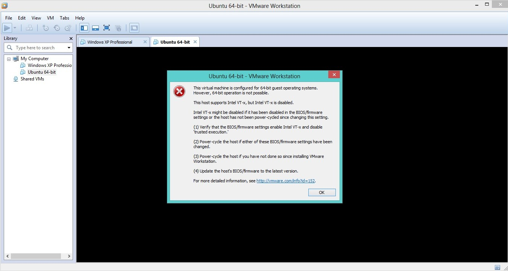

# مجازی‌سازی با کمک سخت‌افزار

یکی از روش‌های معمول و کارای پیاده‌سازی مجازی‌سازی، استفاده از امکانات خاص سخت‌افزاری است. در این روش‌ها، مثلا پردازنده یک سری instruction (دستورات) خاص اضافه‌تر نسبت به حالت معمول در اختیار برنامه‌ها می‌گذارد که نرم‌افزار مجازی‌ساز می‌تواند از این دستورات برای اجرای سیستم‌عامل مهمان استفاده کند. استفاده از این روش، نیاز دارد که پردازنده از این امکان خاص سخت‌افزاری پشتیبانی نماید، در اصطلاح به این امکانات Vistualization Extensions گفته می‌شود.

در پردازنده‌های Intel، به این قابلیت Intel VT-x گفته می‌شود و در پردازنده‌های AMD، به آن AMD-V، که از نظر طراحی با همدیگر کمی متفاوت هستند ولی به هر حال هدف اصلی هر دو یکسان است. معمولا این قابلیت‌ها به صورت پیش‌فرض برای پردازنده‌ها غیر فعال هستند که برای فعال‌سازی آن باید در منوی BIOS به دنبال گزینه‌ای با عنوان Virtualization Technology یا Virtualization Extensions یا Hardware Virtualization Support گشت و آن را فعال نمود.

## کاربرد

در صورتی که بخواهید یک سیستم عامل مهمان ۶۴ بیت را به صورت مجازی اجرا کنید، علاوه بر این که باید سیستم عامل و سخت‌افزار شما ۶۴ بیت باشد، باید Virtualization Extensions هم توسط پردازنده‌ی شما پشتیبانی شود و فعال باشد. برای مثال، در صورتی که پردازنده شما این قابلیت را داشته باشد ولی هنوز آن را فعال نکرده باشید، در هنگام نصب یک مهمان ۶۴ بیتی ممکن است به چنین خطایی بربخورید:

## منابع مفید

1. [Hardware-assisted virtualization](http://en.wikipedia.org/wiki/X86_virtualization#Hardware-assisted_virtualization)
2. [How to Enable Intel Virtualization Technology (vt-x) and amd-v in BIOS](http://www.sysprobs.com/disable-enable-virtualization-technology-bios)

